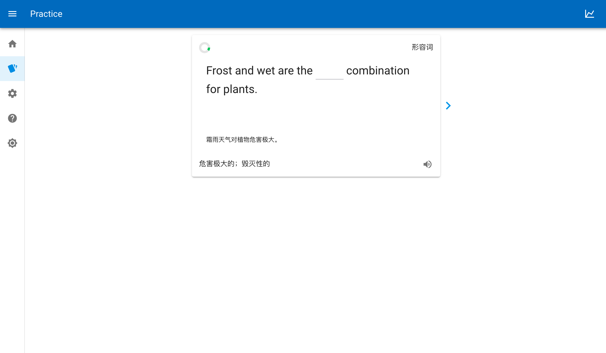
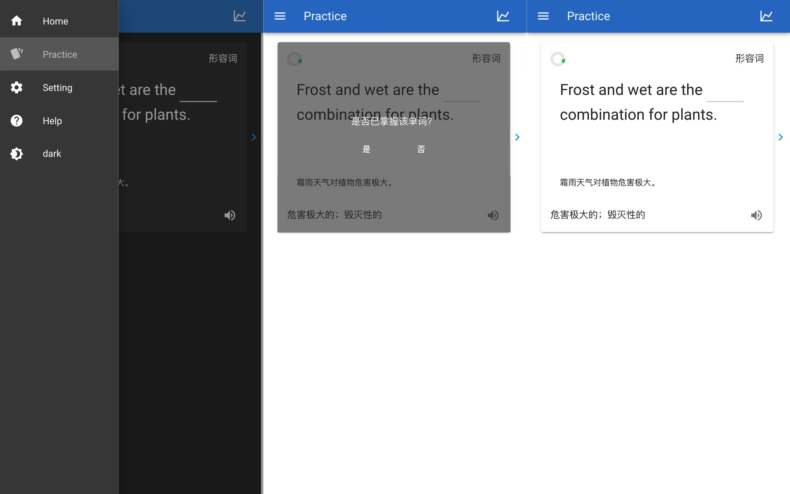

# Light Word

[](https://travis-ci.com/shiroyk/LightWord)
***
轻词是仿[Lingvest](https://lingvist.com/)的一个记忆单词的工具，根据艾宾浩斯遗忘曲线周期性的回忆单词。

## 使用方式

```
git clone --recurse-submodules https://github.com/shiroyk/LightWord.git
cd LightWordFrontend && npm install && npm run build && cd ..
docker-compose up -d
```

## Demo



## Copyright
词典数据来自于Bing dict, Collins, New Century English-Chinese Dictionary, Youdao